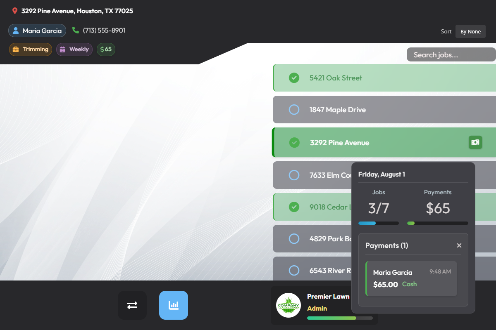
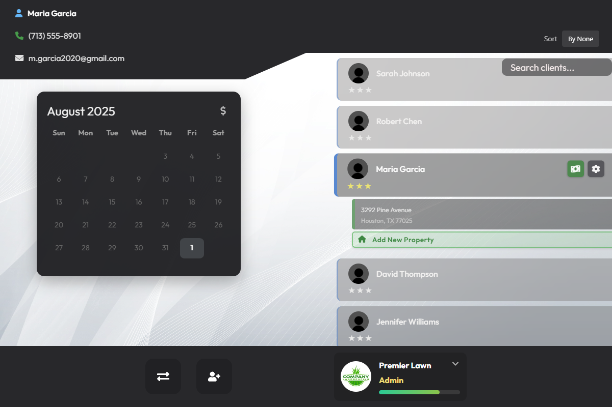
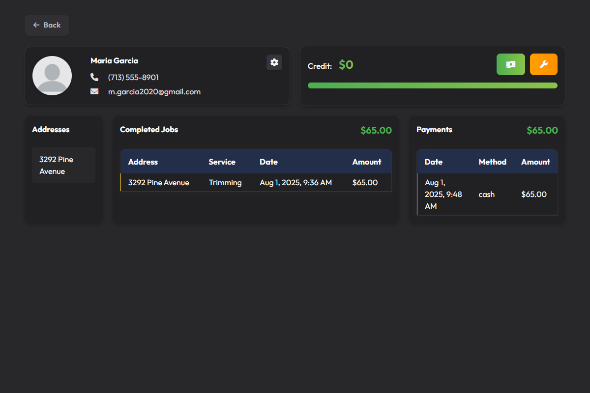

# Logitask

Logitask helps lawn care and property maintenance companies replace spreadsheets with automated daily job lists for recurring clients.

## Features

- Automatically generating daily job lists
- Tracking payments and job completions  
- Providing role-based access for the owner and workers
- Maintaining detailed client history pages and property pages

## Screenshots


*Daily job management interface showing automated job lists and completion tracking*


*Client management dashboard*


*Detailed client payment and service history tracking*

## Tech Stack

- Django
- PostgreSQL
- TypeScript
- React.js
- Microsoft Azure

## Prerequisites

- Python 3.8+ 
- Node.js 18+ 
- npm 8+ 
- Git

**Note:** PostgreSQL is only required for production deployment. This project uses SQLite for local development.

## Installation

### Backend

#### Setup Virtual Environment
1. **Navigate to the Backend Directory:**
   - Ensure you are in the directory containing `manage.py`.

2. **Create and Activate Virtual Environment:**
   - Create the virtual environment:
     ```bash
     python -m venv venv
     ```
   - Activate the virtual environment:
     - **Git Bash:** `source venv/Scripts/activate`
     - **Windows Command Prompt:** `venv\Scripts\activate.bat`
     - **Windows PowerShell:** `venv\Scripts\Activate.ps1`
     - **Mac/Linux:** `source venv/bin/activate`

3. **Install Dependencies:**
   ```bash
   pip install -r requirements.txt
   ```
   
   *Note: To update requirements after installing new packages, run:*
   ```bash
   pip freeze > requirements.txt
   ```

#### Running the Server
Start the Django server:
```bash
python manage.py runserver
```

#### Making Changes to Models
After modifying models, run:
```bash
python manage.py makemigrations
python manage.py migrate
```

### Frontend

#### Running the Frontend
1. **Navigate to the Frontend Directory:**
   - Ensure you are in the directory containing `package.json`.

2. **Install Dependencies:**
   ```bash
   npm install
   ```

3. **Start the Development Server:**
   ```bash
   npm run dev
   ```